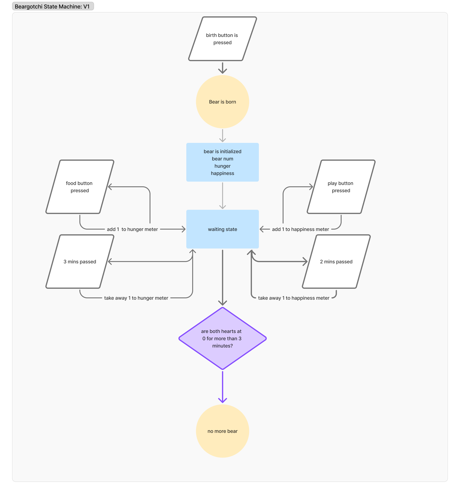

# Beargotchi
The sister repository for the 'Beargotchi' project,  this is to be C based and the next step in developing the full product.

The bear tamagotchi project is to spin up a Tamagotchi like device but bear-like instead. Eventually encapsulating all 8 bear species. First starting with the Polar Bear and then moving onto the others. 

Desgin and spec documents are (to be) located in their respective folders. 

## Build System

In order to allow everyone to participate who has a STM32 chip /nucleo board. Make files and appropriate abstraction for the pin configs (will be) introduced are in the 'beargotchi' second file. this project is generated using CubeMX for the pin configuration and HAL libraries (for now). 

## Flashing

Using openocd 

'''
sudo apt install openocd
'''

or using stm programmer 

to build 

make 

to flash 

openocd -f interface/stlink.cfg -f target/stm32h7x.cfg -c "program build/beargotchi.elf verify reset exit"

### TODO get all the build configs and vscode plugins in here so that it is easy for others to use this

## System Design 

